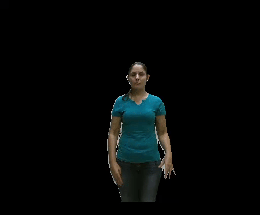

# Brazilian Sign Language Recognition in Healthcare Centers

In this researcg work, we aimed to recognize the common lexical signs used by Brazilian deaf into healthcare  centers  based on Kinect v2. Our approach only uses depth images to extract robust hand-crafted features and classified based on DTW (Dynamic Time Warping) and k-NN (k Nearest Neighbor) algorithms.

## Materials and Methods

* Materials:
  
  First, we choose 107 medical signs selected from common dialogues in health-care centers.
  
  Next, signs were recorded using a Microsoft Kinect v2 sensor which provides color, depth, and skeleton data. The signer perfomed each sign in a stop-motion fashiong six times. 
    
* Methods:

  Depth images have shown their ability to provide both the geometric information and new discHistogram of Oriented Point Cloud Vectorsriminative features, so we dediced to asses the feasibility of depth images to recognize isolated signs of the Brazilian Sign Language  (BSL).
  
  * Temporal segmentation of sign based on stop--motion of the body skeleton.
  * Selection of the ROI (region of interest).
  * Compute features named Histogram of Direction Cosines (or another such as [Histogram of Oriented Point Cloud Vectors](https://doi.org/10.1007/978-3-030-16053-1_55)) after the depth image is mapped to a point cloud.
  * DTW and k-NN as classifier.
  * Model assessment in a context dependent fashion.

## Dataset

* We present some samples of the collected signs. As you can see, signs are either one-handed, two-handed, and some has a slight variation between them.

  * Sicken / Adoecer
    
    
  
  
  * Depression / Depressao
    
    
  
  
  * Respiratory infection / Infecao respiratoria
    
    
    
      
  * Allergy / Alergia
    
    
   
  * Medical scheduling / Agendar
    
    
   

* As follows, we present the 107 names of signs, both in English and Portuguese.

| N° | Sign | Sinal |
| -------- | -------- | -------- |
|	1	|	Sicken	|	Adoecer	|
|	2	|	Medical_scheduling	|	Agendar	|
|	3	|	Now	|	Agora	|
|	4	|	Severe	|	Agudo	|
|	5	|	Needle	|	Agulha	|
|	6	|	Allergy	|	Alergia	|
|	7	|	Tomorrow	|	Amanha	|
|	8	|	Tonsillitis	|	Amigdalites	|
|	9	|	Year	|	Ano	|
|	10	|	Anxiety	|	Ansiedade	|
|	11	|	Appendicitis	|	Apendicites	|
|	12	|	Heart_attack	|	Ataque_Cardiaco	|
|	13	|	Well	|	Bem	|
|	14	|	Bronchitis	|	Bronquite	|
|	15	|	Head	|	Cabeca	|
|	16	|	Mumps	|	Caxumba	|
|	17	|	Surgery	|	Cirurgia	|
|	18	|	Pill	|	Comprimido	|
|	19	|	Medical_consultation	|	Consultar	|
|	20	|	Contusion	|	Contusao	|
|	21	|	Chronic	|	Cronico	|
|	22	|	Toheal	|	Curar	|
|	23	|	His	|	Dele	|
|	24	|	Delirium	|	Delirio	|
|	25	|	Insanity	|	Demencia	|
|	26	|	Dengue	|	Dengue	|
|	27	|	Tooth	|	Dente	|
|	28	|	Depression	|	Depressao	|
|	29	|	Brain_stroke	|	Derrame_Cerebral	|
|	30	|	Dehydration	|	Desidratacao	|
|	31	|	Diabetes	|	Diabete	|
|	32	|	Disease	|	Doenca	|
|	33	|	Toache	|	Doer	|
|	34	|	Headache	|	Dor_Cabeca	|
|	35	|	Electrocardiogram	|	Eletrocardiograma	|
|	36	|	He	|	Ele	|
|	37	|	Address	|	Endereco	|
|	38	|	Nursing	|	Enfermagem	|
|	39	|	Sprain	|	Entorser	|
|	40	|	Poisoning	|	Envenenar	|
|	41	|	Stable	|	Estavel	|
|	42	|	Stethoscope	|	Estetoscopio	|
|	43	|	Stomach	|	Estomago	|
|	44	|	I	|	Eu	|
|	45	|	Medical_exam	|	Exame_Medico	|
|	46	|	Fever	|	Febre	|
|	47	|	Fracture	|	Fraturar	|
|	48	|	Future	|	Futuro	|
|	49	|	Flu	|	Gripe	|
|	50	|	Bleeding	|	Hemorragia	|
|	51	|	Hepatitis	|	Hepatite	|
|	52	|	Hypertension	|	Hipertensao	|
|	53	|	Today	|	Hoje	|
|	54	|	Hospital	|	Hospital	|
|	55	|	Age	|	Idade	|
|	56	|	Unstable	|	Inestavel	|
|	57	|	Respiratory_infection	|	Infecao_Respiratoria	|
|	58	|	Injection	|	Injetar	|
|	59	|	Intoxication	|	Intoxicacao	|
|	60	|	To_go	|	Ir	|
|	61	|	Laceration	|	Laceracao	|
|	62	|	Injury	|	Lesao	|
|	63	|	Knife_injury	|	Lesao_Faca	|
|	64	|	Gun_injury	|	Lesao_Pistola	|
|	65	|	Slight	|	Leve	|
|	66	|	Hurt	|	Mal	|
|	67	|	Doctor	|	Medico	|
|	68	|	My	|	Meu	|
|	69	|	Die	|	Morir	|
|	70	|	Very/Too	|	Muito	|
|	71	|	Do/Does_Not	|	Nao	|
|	72	|	To_cannot	|	Nao_Poder	|
|	73	|	To_want_not	|	Nao_Querer	|
|	74	|	To_have_not	|	Nao_Ter	|
|	75	|	Nausea	|	Nausea	|
|	76	|	Name	|	Nome	|
|	77	|	Yesterday	|	Ontem	|
|	78	|	Hearing_people	|	Ouvinte	|
|	79	|	Past	|	Passado	|
|	80	|	Kidney_stone	|	Pedra_Rim	|
|	81	|	Chest	|	Peito	|
|	82	|	Tocan	|	Poder	|
|	83	|	Afew	|	Pouco	|
|	84	|	Need	|	Precisar	|
|	85	|	Clinical_history	|	Prontuario	|
|	86	|	Psychosis	|	Psicose	|
|	87	|	Lung	|	Pulmao	|
|	88	|	Burs	|	Queimado	|
|	89	|	To_want	|	Querer	|
|	90	|	X-rays	|	Raios_X	|
|	91	|	Medical_prescription	|	Receita_Medica	|
|	92	|	Remedy	|	Remedio	|
|	93	|	Medical_risk	|	Risco	|
|	94	|	Bad	|	Ruim	|
|	95	|	Salmonella	|	Salmonela	|
|	96	|	Healthy	|	Saudavel	|
|	97	|	To_feel	|	Sentir	|
|	98	|	Your	|	Seu	|
|	99	|	Yes	|	Sim	|
|	100	|	Deaf_people	|	Surdo	|
|	101	|	To_have	|	Ter	|
|	102	|	Dizziness	|	Tontura	|
|	103	|	Cough	|	Tos	|
|	104	|	Vaccine	|	Vacinar	|
|	105	|	To_come	|	Vir	|
|	106	|	You	|	Voce	|
|	107	|	Vomit	|	Vomito	|

## Download

The dataset is packed into Matlab files, easily accessible from other programming languages.

If you like to access to our dataset, please feel free to mail to *elias@dca.fee.unicamp.br* or *martino@dca.fee.unicamp.br*.

## How to cite:

If you are interested in more technical details, please read our paper [Brazilian Sign Language Recognition Using Kinect](https://doi.org/10.1007/978-3-319-48881-3_27).

And cite as:

@inproceedings{YauriVidalon2016,
author = {{Yauri Vidal{\'{o}}n}, Jos{\'{e}} El{\'{i}}as and {De Martino}, Jos{\'{e}} Mario},
booktitle = {ECCV 2016 Workshops},
editor = {Hua, Gang and J{\'{e}}gou, Herv{\'{e}}},
isbn = {978-3-319-48881-3},
pages = {391--402},
publisher = {Springer International Publishing},
title = {{Brazilian Sign Language Recognition Using Kinect}},
year = {2016}
}

